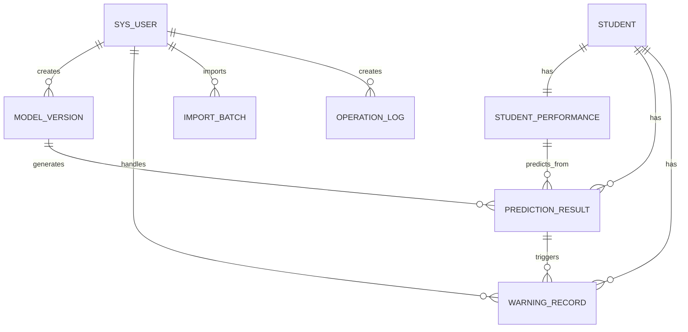

# 学生成绩分析系统数据库设计说明（V0）

> 本文档根据 `src/main/resources/sql/V0.sql` 编写，用于说明当前 Spring Boot 项目的 V0 数据库结构。字段名、表名和约束以 `V0.sql` 为准；主键和外键为了课程项目实现简洁性，统一使用 `INT` 类型。

---

## 1. V0 数据库设计目标

V0 数据库围绕“基于决策树模型的学生成绩分析 Web 系统”的核心功能设计，重点支持以下能力：

1. 用户登录与基础权限区分。
2. 学生基础信息管理。
3. 学习行为与成绩数据维护。
4. CSV 数据字典与导入批次记录。
5. 决策树模型版本管理。
6. 单学生或批量预测结果保存。
7. 学业风险预警生成与处理。
8. 操作日志记录。
9. 面向模型训练的数据视图导出。

V0 版本以当前学生成绩数据集为主要依据，数据集中每个学生只有一条学习表现记录，因此 `student_performance` 表采用“一名学生对应一条表现记录”的设计。该设计适合快速完成课程项目 V1 主线，包括数据导入、统计分析、模型训练、成绩预测和风险预警。

---

## 2. 数据库初始化说明

`V0.sql` 首先创建数据库：

```sql
CREATE DATABASE IF NOT EXISTS student_analytics
DEFAULT CHARACTER SET utf8mb4
DEFAULT COLLATE utf8mb4_unicode_ci;
```

数据库名称为 `student_analytics`，字符集使用 `utf8mb4`，排序规则使用 `utf8mb4_unicode_ci`，可以兼容中文、英文和常见符号。

初始化脚本随后执行：

```sql
USE student_analytics;
SET FOREIGN_KEY_CHECKS = 0;
DROP TABLE IF EXISTS ...
SET FOREIGN_KEY_CHECKS = 1;
```

这说明 `V0.sql` 是开发初始化脚本，会删除已有表并重新创建结构。它适合本地开发、测试环境初始化，不适合在已有正式数据的数据库上直接执行。

---

## 3. 数据表总览

| 序号 | 表名 / 视图名 | 类型 | 主要作用 |
|---:|---|---|---|
| 1 | `sys_user` | 表 | 系统用户、角色、登录信息 |
| 2 | `dict_item` | 表 | 数据集编码字段的字典解释 |
| 3 | `student` | 表 | 学生基础信息 |
| 4 | `student_performance` | 表 | 学习行为和成绩表现 |
| 5 | `model_version` | 表 | 决策树模型版本和评估指标 |
| 6 | `prediction_result` | 表 | 模型预测结果 |
| 7 | `warning_record` | 表 | 学业风险预警记录 |
| 8 | `import_batch` | 表 | CSV 导入批次和错误信息 |
| 9 | `operation_log` | 表 | 系统操作日志 |
| 10 | `v_student_model_dataset` | 视图 | 模型训练和数据导出视图 |

---

## 4. 核心实体关系



V0 的核心关系可以理解为：

- `student` 保存学生基础信息。
- `student_performance` 保存该学生当前的一条学习行为和成绩记录。
- `model_version` 保存训练出来的决策树模型元数据。
- `prediction_result` 记录某次模型对某个学生表现记录的预测输出。
- `warning_record` 根据预测结果、GPA、缺勤次数、学习时长等规则生成风险预警。
- `sys_user` 与模型训练、导入、预警处理、操作日志关联，用于追踪谁执行了系统操作。

---

## 5. 表结构详细说明

### 5.1 用户表 `sys_user`

`sys_user` 用于保存系统登录用户和角色信息。V0 中角色直接使用枚举字段，不单独拆分用户角色表和权限表。

| 字段名 | 类型 | 约束 | 说明 |
|---|---|---|---|
| `id` | `INT` | 主键，自增 | 用户主键 |
| `username` | `VARCHAR(50)` | 非空，唯一 | 登录用户名 |
| `password` | `VARCHAR(255)` | 非空 | 加密后的密码 |
| `real_name` | `VARCHAR(50)` | 可空 | 用户真实姓名或展示名称 |
| `role` | `ENUM('STUDENT','TEACHER','ADMIN')` | 非空，默认 `TEACHER` | 用户角色 |
| `status` | `TINYINT UNSIGNED` | 非空，默认 `1` | 1 表示启用，0 表示禁用 |
| `created_at` | `DATETIME` | 非空，默认当前时间 | 创建时间 |
| `updated_at` | `DATETIME` | 非空，自动更新时间 | 更新时间 |

索引和约束：

- 主键：`PRIMARY KEY (id)`
- 唯一索引：`uk_sys_user_username (username)`

角色说明：

| 角色 | 说明 |
|---|---|
| `ADMIN` | 管理员，可维护用户、数据、模型和日志 |
| `TEACHER` | 教师或辅导员，可管理学生数据、查看分析、处理预警 |
| `STUDENT` | 学生角色，后续可用于个人成绩查看 |

---

### 5.2 字典表 `dict_item`

`dict_item` 用于解释数据集中大量数字编码字段。这样后端可以保存原始编码，同时前端展示时可以通过字典转成可读文本。

| 字段名 | 类型 | 约束 | 说明 |
|---|---|---|---|
| `id` | `INT` | 主键，自增 | 字典项主键 |
| `dict_type` | `VARCHAR(50)` | 非空 | 字典类型，例如 `gender`、`grade_class` |
| `item_code` | `TINYINT` | 非空 | 数据集中的编码值 |
| `item_label` | `VARCHAR(100)` | 非空 | 展示标签 |
| `sort_order` | `INT` | 非空，默认 `0` | 排序值 |
| `description` | `VARCHAR(255)` | 可空 | 说明 |

索引和约束：

- 主键：`PRIMARY KEY (id)`
- 唯一索引：`uk_dict_type_code (dict_type, item_code)`
- 普通索引：`idx_dict_type (dict_type)`

V0 初始化时写入以下字典：

| 字典类型 | 编码范围 | 说明 |
|---|---|---|
| `gender` | `0, 1` | 性别 |
| `ethnicity` | `0, 1, 2, 3` | 族裔或群体编码 |
| `parental_education` | `0, 1, 2, 3, 4` | 父母受教育程度 |
| `parental_support` | `0, 1, 2, 3, 4` | 父母学业支持程度 |
| `yes_no` | `0, 1` | 是否类字段 |
| `grade_class` | `0, 1, 2, 3, 4` | 成绩等级 |

`grade_class` 编码规则：

| 编码 | 等级 | GPA 范围 |
|---:|---|---|
| 0 | A | `3.5 <= GPA <= 4.0` |
| 1 | B | `3.0 <= GPA < 3.5` |
| 2 | C | `2.5 <= GPA < 3.0` |
| 3 | D | `2.0 <= GPA < 2.5` |
| 4 | F | `GPA < 2.0` |

根据 `dataset/Student_performance_data _.csv` 的实际数据分布，`GradeClass` 数值越大，整体 GPA 越低。因此 V0 保留数据集原始语义：`0` 表示最高等级 A，`4` 表示最低等级 F。若 CSV 原始 `GradeClass` 与根据 GPA 计算出的等级不一致，导入逻辑应优先使用系统计算出的 `grade_class`，同时通过 `data_quality_status` 和 `quality_issue` 标记该行存在质量问题。

---

### 5.3 学生基础信息表 `student`

`student` 保存学生静态基础信息，对应 CSV 数据集中的 `StudentID`、年龄、性别、族裔、父母受教育程度等字段。

| 字段名 | 类型 | 约束 | 说明 |
|---|---|---|---|
| `id` | `INT` | 主键，自增 | 学生表内部主键 |
| `student_no` | `INT` | 非空，唯一 | 原始学生编号，对应 CSV 中的学生 ID |
| `name` | `VARCHAR(50)` | 可空 | 展示姓名，CSV 中没有姓名时可人工生成 |
| `age` | `INT` | 非空 | 年龄 |
| `gender` | `TINYINT` | 非空 | 性别编码，对应 `dict_item.gender` |
| `ethnicity` | `TINYINT` | 非空 | 族裔编码，对应 `dict_item.ethnicity` |
| `parental_education` | `TINYINT` | 非空 | 父母受教育程度编码 |
| `created_at` | `DATETIME` | 非空，默认当前时间 | 创建时间 |
| `updated_at` | `DATETIME` | 非空，自动更新时间 | 更新时间 |
| `deleted` | `TINYINT` | 非空，默认 `0` | 软删除标记，0 正常，1 删除 |

索引和约束：

- 主键：`PRIMARY KEY (id)`
- 唯一索引：`uk_student_no (student_no)`
- 查询索引：`idx_student_age`、`idx_student_gender`、`idx_student_ethnicity`、`idx_student_parental_education`
- 检查约束：
  - `age BETWEEN 0 AND 120`
  - `gender IN (0, 1)`
  - `ethnicity IN (0, 1, 2, 3)`
  - `parental_education IN (0, 1, 2, 3, 4)`
  - `deleted IN (0, 1)`

业务说明：

- `student_no` 用于和原始 CSV 保持对应。
- `id` 是数据库内部关联使用的主键。
- `deleted` 采用软删除设计，删除学生时可以先标记为删除，而不是直接物理删除。

---

### 5.4 学习表现表 `student_performance`

`student_performance` 保存学生学习行为和成绩表现，是模型训练、统计分析、风险预警的核心数据表。

| 字段名 | 类型 | 约束 | 说明 |
|---|---|---|---|
| `id` | `INT` | 主键，自增 | 学习表现记录主键 |
| `student_id` | `INT` | 非空，外键 | 关联 `student.id` |
| `study_time_weekly` | `DECIMAL(7,4)` | 非空 | 每周学习时长 |
| `absences` | `INT` | 非空 | 缺勤次数 |
| `tutoring` | `TINYINT` | 非空 | 是否接受额外辅导，0 否，1 是 |
| `parental_support` | `TINYINT` | 非空 | 父母支持程度，0 到 4 |
| `extracurricular` | `TINYINT` | 非空 | 是否参加课外活动 |
| `sports` | `TINYINT` | 非空 | 是否参加体育活动 |
| `music` | `TINYINT` | 非空 | 是否参加音乐活动 |
| `volunteering` | `TINYINT` | 非空 | 是否参加志愿活动 |
| `gpa` | `DECIMAL(5,4)` | 非空 | GPA，范围 0 到 4 |
| `grade_class` | `TINYINT` | 非空 | 成绩等级编码，0=A，1=B，2=C，3=D，4=F |
| `data_source` | `ENUM('CSV','MANUAL')` | 非空，默认 `CSV` | 数据来源 |
| `data_quality_status` | `TINYINT` | 非空，默认 `0` | 数据质量状态，0 正常，1 警告，2 无效 |
| `quality_issue` | `VARCHAR(255)` | 可空 | 数据质量原因 |
| `created_at` | `DATETIME` | 非空，默认当前时间 | 创建时间 |
| `updated_at` | `DATETIME` | 非空，自动更新时间 | 更新时间 |

索引和约束：

- 主键：`PRIMARY KEY (id)`
- 唯一索引：`uk_performance_student_id (student_id)`
- 查询索引：`idx_perf_grade_class`、`idx_perf_gpa`、`idx_perf_absences`、`idx_perf_study_time_weekly`
- 外键：`student_id` 关联 `student(id)`，学生删除时级联删除表现记录。
- 检查约束：
  - `study_time_weekly >= 0 AND study_time_weekly <= 60`
  - `absences >= 0 AND absences <= 30`
  - `tutoring IN (0, 1)`
  - `parental_support IN (0, 1, 2, 3, 4)`
  - `extracurricular IN (0, 1)`
  - `sports IN (0, 1)`
  - `music IN (0, 1)`
  - `volunteering IN (0, 1)`
  - `gpa >= 0 AND gpa <= 4`
  - `grade_class IN (0, 1, 2, 3, 4)`
  - `data_quality_status IN (0, 1, 2)`

业务说明：

- `UNIQUE KEY uk_performance_student_id (student_id)` 表示 V0 中每个学生只有一条表现记录。
- 若后续要支持按学期或考试展示成绩趋势，需要移除该唯一约束，并增加 `term`、`record_date` 等字段。
- 决策树预测 `grade_class` 时，应避免把 `gpa` 作为输入特征，因为 `grade_class` 本身由 GPA 派生，加入 GPA 会造成目标泄露。
- 导入 CSV 时，如果原始 `GradeClass` 与根据 GPA 计算出的等级不一致，可将 `data_quality_status` 标记为 `1`，并在 `quality_issue` 中记录 `GRADE_CLASS_GPA_MISMATCH` 等原因。

---

### 5.5 模型版本表 `model_version`

`model_version` 保存每一次模型训练的元数据，包括特征列、算法参数、评估指标和模型文件路径。

| 字段名 | 类型 | 约束 | 说明 |
|---|---|---|---|
| `id` | `INT` | 主键，自增 | 模型版本主键 |
| `model_name` | `VARCHAR(100)` | 非空，默认值 | 模型名称 |
| `version_no` | `VARCHAR(50)` | 非空，唯一 | 模型版本号 |
| `algorithm` | `VARCHAR(50)` | 非空 | 算法名称 |
| `feature_columns` | `JSON` | 非空 | 模型输入特征字段列表 |
| `target_column` | `VARCHAR(50)` | 非空，默认值 | 预测目标字段 |
| `criterion` | `VARCHAR(50)` | 可空 | 决策树划分标准，如 `gini`、`entropy` |
| `max_depth` | `INT` | 可空 | 决策树最大深度 |
| `min_samples_leaf` | `INT` | 可空 | 叶子节点最小样本数 |
| `accuracy` | `DECIMAL(6,4)` | 可空 | 准确率 |
| `precision_macro` | `DECIMAL(6,4)` | 可空 | 宏平均 Precision |
| `recall_macro` | `DECIMAL(6,4)` | 可空 | 宏平均 Recall |
| `f1_macro` | `DECIMAL(6,4)` | 可空 | 宏平均 F1 |
| `confusion_matrix_json` | `JSON` | 可空 | 混淆矩阵 |
| `model_path` | `VARCHAR(255)` | 可空 | 模型文件路径 |
| `encoder_path` | `VARCHAR(255)` | 可空 | 编码器文件路径 |
| `is_active` | `TINYINT` | 非空，默认 `0` | 是否为当前启用模型 |
| `trained_at` | `DATETIME` | 可空 | 训练时间 |
| `created_by` | `INT` | 可空，外键 | 创建人，关联 `sys_user.id` |
| `created_at` | `DATETIME` | 非空，默认当前时间 | 创建时间 |

索引和约束：

- 主键：`PRIMARY KEY (id)`
- 唯一索引：`uk_model_version_no (version_no)`
- 查询索引：`idx_model_active (is_active)`
- 外键：`created_by` 关联 `sys_user(id)`，用户删除时置空。
- 检查约束：`is_active IN (0, 1)`

业务说明：

- 每次训练决策树后，都应插入一条 `model_version`。
- `feature_columns` 应明确记录训练使用的字段，便于后续预测时保持输入一致。
- `is_active` 可用于标记当前默认使用的模型版本。

---

### 5.6 预测结果表 `prediction_result`

`prediction_result` 保存模型对学生成绩等级的预测结果。

| 字段名 | 类型 | 约束 | 说明 |
|---|---|---|---|
| `id` | `INT` | 主键，自增 | 预测结果主键 |
| `student_id` | `INT` | 非空，外键 | 关联 `student.id` |
| `performance_id` | `INT` | 非空，外键 | 关联 `student_performance.id` |
| `model_version_id` | `INT` | 非空，外键 | 关联 `model_version.id` |
| `predicted_grade_class` | `TINYINT` | 非空 | 预测成绩等级编码 |
| `predicted_grade_label` | `CHAR(1)` | 非空 | 预测成绩等级标签，A/B/C/D/F |
| `probability_json` | `JSON` | 可空 | 各等级预测概率 |
| `important_factors_json` | `JSON` | 可空 | 主要影响因素 |
| `predict_input_json` | `JSON` | 可空 | 本次预测使用的输入快照 |
| `created_at` | `DATETIME` | 非空，默认当前时间 | 创建时间 |

索引和约束：

- 主键：`PRIMARY KEY (id)`
- 查询索引：`idx_pred_student_id`、`idx_pred_model_version_id`、`idx_pred_grade_class`
- 外键：
  - `student_id` 关联 `student(id)`，学生删除时级联删除预测结果。
  - `performance_id` 关联 `student_performance(id)`，表现记录删除时级联删除预测结果。
  - `model_version_id` 关联 `model_version(id)`，模型版本被预测记录引用时限制删除。
- 检查约束：`predicted_grade_class IN (0, 1, 2, 3, 4)`

业务说明：

- 单个学生可以有多条预测结果，因为可以使用不同模型版本或不同时间执行预测。
- `predict_input_json` 用于保存预测时的输入快照，避免后续学生表现数据修改后无法复现当时预测。
- `probability_json` 可以保存类似 `{"A":0.1,"B":0.2,"C":0.3,"D":0.2,"F":0.2}` 的概率分布。

---

### 5.7 风险预警表 `warning_record`

`warning_record` 保存根据模型预测和规则评分生成的学业风险预警。

| 字段名 | 类型 | 约束 | 说明 |
|---|---|---|---|
| `id` | `INT` | 主键，自增 | 预警记录主键 |
| `student_id` | `INT` | 非空，外键 | 关联 `student.id` |
| `prediction_result_id` | `INT` | 可空，外键 | 关联 `prediction_result.id` |
| `risk_score` | `TINYINT` | 非空 | 风险分数，0 到 100 |
| `risk_level` | `ENUM('LOW','MEDIUM','HIGH')` | 非空 | 风险等级 |
| `risk_reasons_json` | `JSON` | 可空 | 风险原因 |
| `suggestion_json` | `JSON` | 可空 | 干预建议 |
| `status` | `ENUM('UNPROCESSED','PROCESSING','DONE','IGNORED')` | 非空，默认 `UNPROCESSED` | 处理状态 |
| `handler_user_id` | `INT` | 可空，外键 | 处理人，关联 `sys_user.id` |
| `created_at` | `DATETIME` | 非空，默认当前时间 | 创建时间 |
| `updated_at` | `DATETIME` | 非空，自动更新时间 | 更新时间 |

索引和约束：

- 主键：`PRIMARY KEY (id)`
- 查询索引：`idx_warning_student_id`、`idx_warning_risk_level`、`idx_warning_status`
- 外键：
  - `student_id` 关联 `student(id)`，学生删除时级联删除预警。
  - `prediction_result_id` 关联 `prediction_result(id)`，预测结果删除时置空。
  - `handler_user_id` 关联 `sys_user(id)`，处理人删除时置空。
- 检查约束：`risk_score BETWEEN 0 AND 100`

风险等级建议：

| 分数范围 | 风险等级 | 含义 |
|---:|---|---|
| 0-24 | `LOW` | 风险较低 |
| 25-49 | `MEDIUM` | 需要关注 |
| 50-100 | `HIGH` | 高风险，需要及时干预 |

状态说明：

| 状态 | 说明 |
|---|---|
| `UNPROCESSED` | 未处理 |
| `PROCESSING` | 处理中 |
| `DONE` | 已完成 |
| `IGNORED` | 已忽略 |

---

### 5.8 导入批次表 `import_batch`

`import_batch` 用于记录 CSV 导入任务的整体执行结果。

| 字段名 | 类型 | 约束 | 说明 |
|---|---|---|---|
| `id` | `INT` | 主键，自增 | 导入批次主键 |
| `file_name` | `VARCHAR(255)` | 非空 | 导入文件名 |
| `total_count` | `INT` | 非空，默认 `0` | 总记录数 |
| `success_count` | `INT` | 非空，默认 `0` | 成功导入条数 |
| `fail_count` | `INT` | 非空，默认 `0` | 失败条数 |
| `status` | `ENUM('PENDING','SUCCESS','FAILED','PARTIAL')` | 非空，默认 `PENDING` | 导入状态 |
| `error_message` | `TEXT` | 可空 | 错误信息 |
| `imported_by` | `INT` | 可空，外键 | 导入人，关联 `sys_user.id` |
| `created_at` | `DATETIME` | 非空，默认当前时间 | 创建时间 |

索引和约束：

- 主键：`PRIMARY KEY (id)`
- 查询索引：`idx_import_status (status)`
- 外键：`imported_by` 关联 `sys_user(id)`，用户删除时置空。

业务说明：

- 导入前可先插入 `PENDING` 状态记录。
- 导入完成后根据结果更新为 `SUCCESS`、`FAILED` 或 `PARTIAL`。
- `error_message` 可以保存字段缺失、数值越界、重复学号等错误摘要。

---

### 5.9 操作日志表 `operation_log`

`operation_log` 用于记录系统中的关键操作，便于审计和问题排查。

| 字段名 | 类型 | 约束 | 说明 |
|---|---|---|---|
| `id` | `INT` | 主键，自增 | 日志主键 |
| `user_id` | `INT` | 可空，外键 | 操作用户 |
| `module_name` | `VARCHAR(50)` | 非空 | 模块名，例如 student、performance、model、warning |
| `operation_type` | `VARCHAR(50)` | 非空 | 操作类型，例如 CREATE、UPDATE、DELETE、IMPORT、TRAIN、PREDICT |
| `description` | `VARCHAR(255)` | 可空 | 操作描述 |
| `request_method` | `VARCHAR(10)` | 可空 | HTTP 方法 |
| `request_uri` | `VARCHAR(255)` | 可空 | 请求地址 |
| `ip_address` | `VARCHAR(64)` | 可空 | IP 地址 |
| `created_at` | `DATETIME` | 非空，默认当前时间 | 创建时间 |

索引和约束：

- 主键：`PRIMARY KEY (id)`
- 查询索引：`idx_log_user_id (user_id)`
- 组合索引：`idx_log_module_type (module_name, operation_type)`
- 外键：`user_id` 关联 `sys_user(id)`，用户删除时置空。

---

## 6. 模型训练视图 `v_student_model_dataset`

`v_student_model_dataset` 是面向模型训练和数据导出的视图，它把 `student` 和 `student_performance` 合并为接近原始 CSV 的结构。

视图字段如下：

| 视图字段 | 来源字段 | 说明 |
|---|---|---|
| `StudentID` | `student.student_no` | 原始学生编号 |
| `Age` | `student.age` | 年龄 |
| `Gender` | `student.gender` | 性别编码 |
| `Ethnicity` | `student.ethnicity` | 族裔编码 |
| `ParentalEducation` | `student.parental_education` | 父母受教育程度 |
| `StudyTimeWeekly` | `student_performance.study_time_weekly` | 每周学习时长 |
| `Absences` | `student_performance.absences` | 缺勤次数 |
| `Tutoring` | `student_performance.tutoring` | 是否辅导 |
| `ParentalSupport` | `student_performance.parental_support` | 父母支持程度 |
| `Extracurricular` | `student_performance.extracurricular` | 是否参加课外活动 |
| `Sports` | `student_performance.sports` | 是否参加体育 |
| `Music` | `student_performance.music` | 是否参加音乐 |
| `Volunteering` | `student_performance.volunteering` | 是否参加志愿活动 |
| `GPA` | `student_performance.gpa` | GPA |
| `GradeClass` | `student_performance.grade_class` | 成绩等级 |

视图筛选条件：

```sql
WHERE s.deleted = 0
```

这表示模型训练和导出时默认排除已软删除学生。

使用注意：

- 训练 `GradeClass` 预测模型时，可以从该视图读取数据。
- 特征列应排除 `GPA` 和 `GradeClass`，其中 `GradeClass` 是预测目标，`GPA` 会造成目标泄露。
- `GPA` 仍可用于统计分析、风险规则和人工查看。

---

## 7. 核心业务流程与数据库关系

### 7.1 CSV 数据导入流程

1. 用户上传 CSV 文件。
2. 系统在 `import_batch` 中创建导入批次记录。
3. 后端校验字段完整性和数值范围。
4. 合法数据写入 `student` 和 `student_performance`。
5. 更新 `import_batch.total_count`、`success_count`、`fail_count` 和 `status`。
6. 如有错误，将摘要写入 `import_batch.error_message`。
7. 关键操作可写入 `operation_log`。

涉及表：

```text
sys_user -> import_batch
student -> student_performance
operation_log
```

### 7.2 决策树模型训练流程

1. 系统从 `v_student_model_dataset` 读取训练数据。
2. 后端或 Python 模型服务完成数据清洗和特征选择。
3. 使用学习行为、家庭支持、缺勤、活动参与等字段训练决策树。
4. 评估 Accuracy、Precision、Recall、F1、Confusion Matrix。
5. 保存模型文件和编码器文件。
6. 在 `model_version` 中写入模型版本、参数和评估指标。

涉及表和视图：

```text
v_student_model_dataset
model_version
sys_user
operation_log
```

### 7.3 单学生预测流程

1. 用户选择学生。
2. 系统读取 `student` 和 `student_performance`。
3. 选择当前启用的 `model_version`。
4. 使用模型输出 `predicted_grade_class` 和 `predicted_grade_label`。
5. 保存预测概率、重要因素和输入快照到 `prediction_result`。

涉及表：

```text
student
student_performance
model_version
prediction_result
```

### 7.4 学业风险预警流程

1. 系统读取某个学生的预测结果和学习表现。
2. 根据规则计算风险分数。
3. 根据风险分数确定 `risk_level`。
4. 将风险原因写入 `risk_reasons_json`。
5. 将干预建议写入 `suggestion_json`。
6. 保存到 `warning_record`。
7. 教师或管理员后续修改 `status` 并记录 `handler_user_id`。

涉及表：

```text
prediction_result
student
student_performance
warning_record
sys_user
```

---

## 8. 数据校验规则

V0 中部分字段通过 MySQL `CHECK` 约束限制取值范围：

| 表名 | 字段 | 规则 |
|---|---|---|
| `student` | `age` | `0 <= age <= 120` |
| `student` | `gender` | `gender IN (0, 1)` |
| `student` | `ethnicity` | `ethnicity IN (0, 1, 2, 3)` |
| `student` | `parental_education` | `parental_education IN (0, 1, 2, 3, 4)` |
| `student` | `deleted` | `deleted IN (0, 1)` |
| `student_performance` | `study_time_weekly` | `0 <= study_time_weekly <= 60` |
| `student_performance` | `absences` | `0 <= absences <= 30` |
| `student_performance` | `tutoring` | `tutoring IN (0, 1)` |
| `student_performance` | `parental_support` | `parental_support IN (0, 1, 2, 3, 4)` |
| `student_performance` | `extracurricular` | `extracurricular IN (0, 1)` |
| `student_performance` | `sports` | `sports IN (0, 1)` |
| `student_performance` | `music` | `music IN (0, 1)` |
| `student_performance` | `volunteering` | `volunteering IN (0, 1)` |
| `student_performance` | `gpa` | `0 <= gpa <= 4` |
| `student_performance` | `grade_class` | `grade_class IN (0, 1, 2, 3, 4)` |
| `model_version` | `is_active` | `is_active IN (0, 1)` |
| `prediction_result` | `predicted_grade_class` | `predicted_grade_class IN (0, 1, 2, 3, 4)` |
| `warning_record` | `risk_score` | `0 <= risk_score <= 100` |

后端仍需要进行参数校验。数据库约束主要用于兜底，不能替代接口层的错误提示和导入错误报告。

---

## 9. 索引设计说明

V0 的索引主要服务于以下查询场景：

1. 登录查询：`sys_user.username` 使用唯一索引。
2. 学生查询：按 `student_no`、年龄、性别、族裔、父母受教育程度筛选。
3. 成绩分析：按 `grade_class`、`gpa`、`absences`、`study_time_weekly` 统计。
4. 模型查询：按 `is_active` 找当前启用模型。
5. 预测查询：按学生、模型版本、预测等级筛选。
6. 预警查询：按学生、风险等级、处理状态筛选。
7. 操作日志：按用户、模块和操作类型查询。

这些索引能够覆盖课程项目 V1 中常见的列表查询、筛选查询和统计分析接口。

---

## 10. V0 边界与后续扩展

V0 为了尽快完成核心功能，对设计做了简化：

1. `student_performance` 使用一人一条记录，暂不支持学期趋势。
2. 用户角色直接放在 `sys_user.role`，暂不拆 RBAC 权限表。
3. 预警处理只记录当前处理人和状态，暂不单独设计多条干预记录。
4. 模型文件本身不存数据库，只保存 `model_path` 和 `encoder_path`。
5. 字典表只保存编码和标签，不强制和业务表建立外键。

后续可扩展方向：

1. 将 `student_performance` 扩展为多学期成绩记录，增加 `term` 和 `record_date`。
2. 增加 `intervention_record` 表，记录多次干预内容和结果。
3. 增加用户权限表，实现更完整的 RBAC。
4. 增加模型训练任务表，支持异步训练和批量预测。
5. 增加导入明细错误表，保存每一行失败原因。
6. 增加图表缓存或统计中间表，提高大数据量下的分析性能。

---

## 11. 总结

`V0.sql` 的数据库结构已经能够支撑学生成绩分析系统的核心闭环：用户登录后导入或维护学生数据，系统基于 `student` 和 `student_performance` 进行统计分析，通过 `v_student_model_dataset` 导出训练数据，训练后的模型记录在 `model_version`，预测输出写入 `prediction_result`，风险评分结果写入 `warning_record`，关键操作写入 `operation_log`。

该设计与系统设计文档中的 V1 主线一致，但采用了更适合课程项目快速实现的简化结构。后续开发时，实体类、Mapper、接口字段应优先与本 SQL 保持一致，避免文档中的旧命名和当前数据库命名混用。
